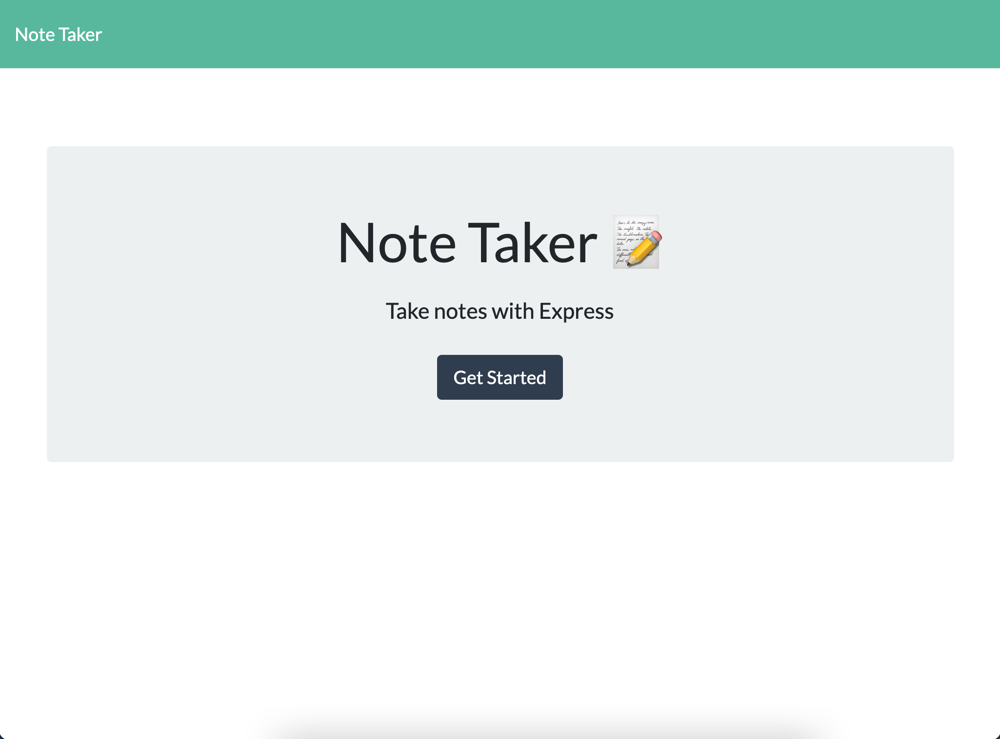
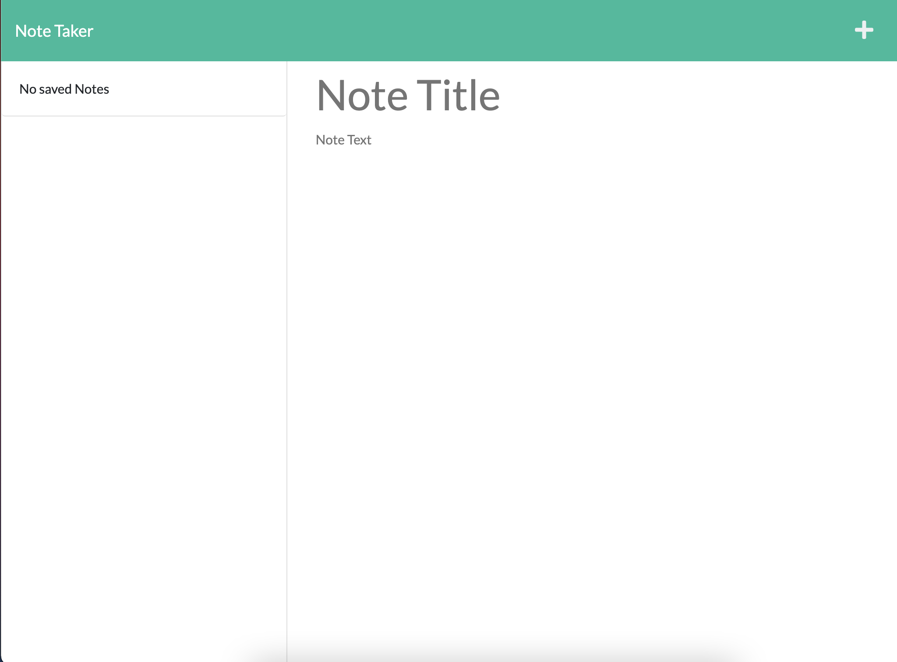
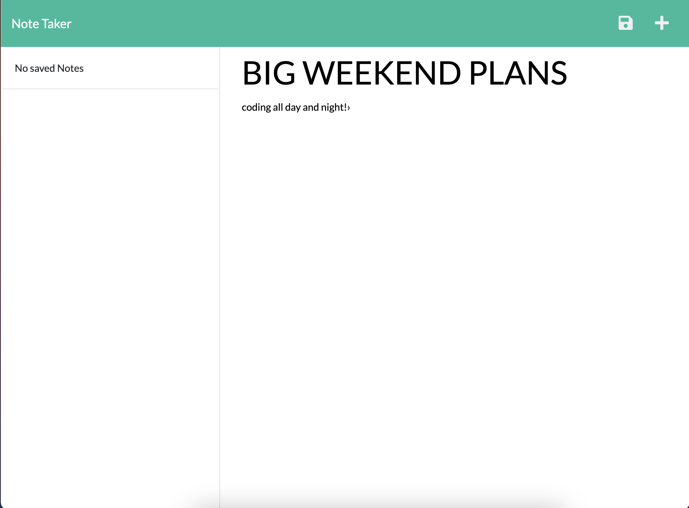
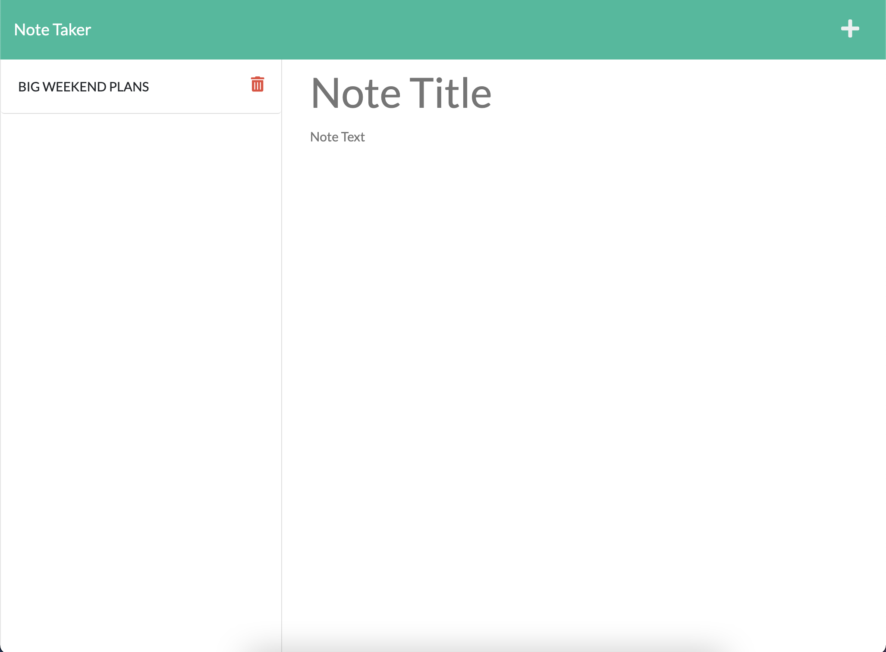
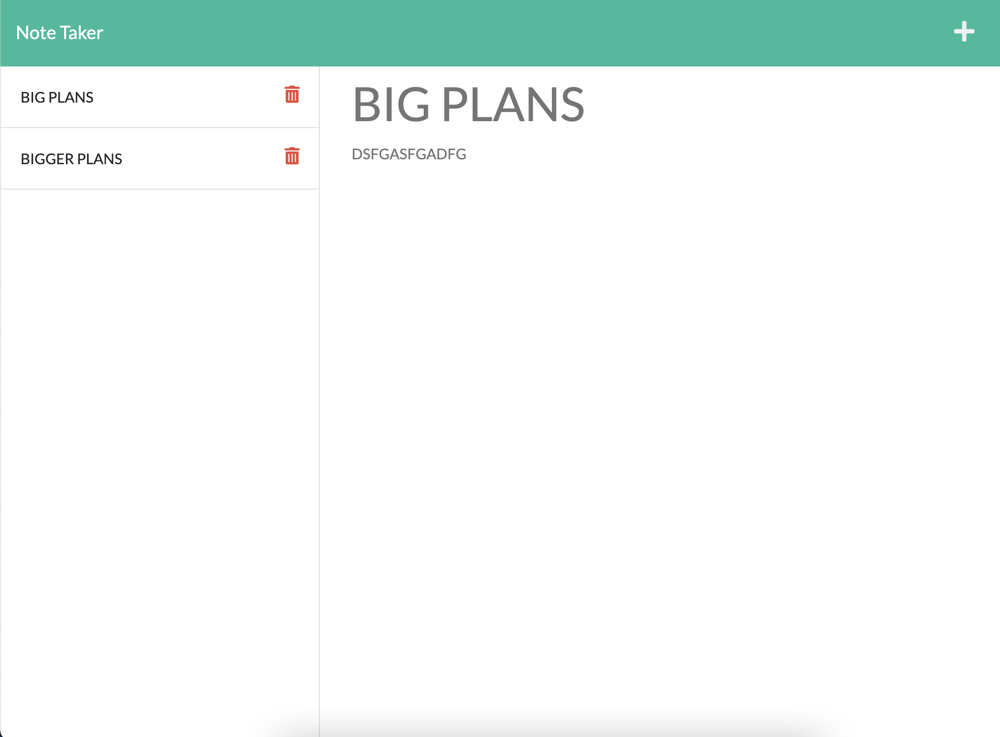
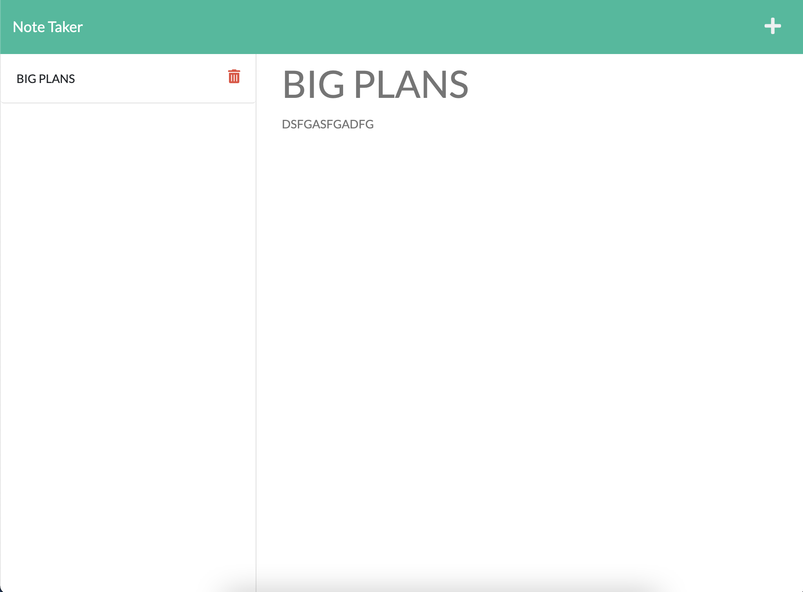

# NOTE TAKER

## Description

Using Node.js to create a note taking app that can be added to and cleared.
When a note is added, HTML is dynamically generated, the server is updated, and CSS styles are applied.

## Usage

Provide instructions and examples for use. Include screenshots as needed.
To add a screenshot, create an `assets/images` folder in your repository and upload your screenshot to it. Then, using the relative filepath, add it to your README using the following syntax:
Front page when app is launch

When you click "Get Started" you are lead to the note taking page

When I fill out the prompt and hit save...

It is saved on the left side.

You can take and save multiple notes

And delete any notes you no longer want

